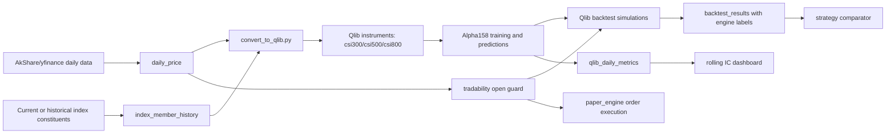

# P0 Trustworthiness Design

Review date: 2026-05-15
Scope: P0 work for the `make-money` system after the system-level review

## Goal

Make the system's daily production loop and backtest evidence credible enough to guide a retail investor using limited capital and weekly/monthly rebalancing. This design does not try to add new alpha families. It first removes the largest ways the current system can overstate performance or execute impossible trades.

## Confirmed Problems

1. Historical backtests and Qlib instruments are built from the current stock universe. This creates survivorship bias.
2. Paper trading and custom Qlib backtest simulations use open prices without a shared tradability guard for ST, suspension, and A-share open limit conditions.
3. Vectorbt results are saved into the same comparison surface as Qlib results, but the engine lacks the same execution and cost assumptions.
4. The full close workflow exists, but `scripts/daily_update.py` remains a partial entry point that only updates market data and restarts Dashboard.
5. Daily IC is already persisted in `qlib_daily_metrics`, but the product view does not yet show rolling decay windows for strategy health monitoring.

## Design Decisions

### D1. Historical Membership

Add a first-class `index_member_history` table with date ranges:

```sql
CREATE TABLE IF NOT EXISTS index_member_history (
    index_code VARCHAR NOT NULL,
    symbol VARCHAR NOT NULL,
    start_date DATE NOT NULL,
    end_date DATE,
    source VARCHAR,
    created_at TIMESTAMP DEFAULT CURRENT_TIMESTAMP,
    updated_at TIMESTAMP DEFAULT CURRENT_TIMESTAMP,
    PRIMARY KEY (index_code, symbol, start_date)
);
```

The system will support two data-quality levels:

- `historical`: membership date ranges are loaded from a source that provides changes or dated constituents.
- `snapshot`: only the latest constituent list is available. The loader stores it with a conservative `start_date` equal to the first local price date and `source='akshare_snapshot'`.

The implementation must label snapshot-derived history explicitly. Backtests can still run with snapshot history, but reports must expose `membership_source_quality` so the user knows survivorship risk remains.

### D2. Qlib Instruments

`scripts/convert_to_qlib.py` will write separate instrument files:

- `all.txt`: all symbols with local price start/end dates.
- `csi300.txt`: symbols and active date ranges from `index_member_history` where `index_code='000300'`.
- `csi500.txt`: symbols and active date ranges from `index_member_history` where `index_code='000905'`.
- `csi800.txt`: union of CSI300 and CSI500 membership ranges, merged per symbol when ranges overlap.

Alpha158 production should use `csi800` by default because the current local A-share pool is HS300 plus CSI500. Existing config values that refer to `csi300` should continue to work.

### D3. Tradability Guard

Create a shared module `src/portfolio/tradability.py` with small pure functions:

- `derive_prev_close(prices)`: uses `pre_close` when present, otherwise per-symbol lagged close.
- `is_cn_open_limit(open_price, prev_close, threshold=0.095)`: returns true when open is at or beyond A-share limit threshold.
- `annotate_open_tradability(prices, market='CN')`: adds `tradable_at_open` and `non_tradable_reason`.

Rules:

- `is_suspended = TRUE` means no open fill.
- `is_st = TRUE` means no open fill for production and default backtests.
- For CN only, if `abs(open / prev_close - 1) >= 0.095`, the open is treated as not fillable.
- If `prev_close` is missing, do not block by limit rule; still block suspension/ST.

Paper trading uses the same guard before inserting an order. Backtests use the guard before selecting entry candidates. This keeps daily order execution and research evidence aligned.

### D4. Backtest Engine Labels

Add metadata to `backtest_results`:

- `engine`: `qlib_custom`, `vectorbt_research`, or future engine names.
- `cost_model`: human-readable cost model label.
- `tradability_model`: `open_guard_v1`, `none`, or future model names.

`src/backtest/comparator.py` will default to comparable production-like rows only:

- include `engine IN ('qlib_custom')`, or legacy `NULL` rows only when explicitly requested.
- exclude `vectorbt_research` unless the caller asks for research rows.

Vectorbt can remain as a quick research tool. It must not silently compete with production-like Qlib results.

### D5. Workflow Consistency

`scripts/daily_close.sh` and Dashboard's `daily_close_workflow` are the canonical production loop. `scripts/daily_update.py` will become a compatibility wrapper that delegates to the full close workflow or prints a clear message and exits non-zero if the full workflow cannot run.

The full loop must include:

1. market update
2. index fund update
3. index fund signal generation
4. rule signal generation
5. Qlib production prediction
6. rule/Qlib A-B snapshot
7. paper trading
8. NAV rebuild
9. performance review

### D6. Rolling IC Decay

Use existing `qlib_daily_metrics`; do not create a redundant IC table for P0. Add rolling fields in the Dashboard query or Pandas layer:

- `rank_ic_roll_30`
- `rank_ic_roll_60`
- `rank_ic_roll_180`
- `ic_roll_30`
- `ic_roll_60`
- `ic_roll_180`

Display rules:

- Show rolling RankIC and rolling IC in the existing Qlib "因子/IC" tab.
- Add summary cards for the latest 30/60/180 values.
- Warn when 60-day rolling RankIC is below or equal to zero.

## Data Flow



## Files

- Modify `src/data_pipeline/schema.sql`: add `index_member_history`; add engine metadata columns to `backtest_results`.
- Modify `src/data_pipeline/loader.py`: add idempotent `ALTER TABLE` statements and upsert helpers.
- Create `src/data_pipeline/index_membership.py`: normalize, merge, persist, and query membership ranges.
- Modify `src/data_pipeline/main.py`: persist current constituent snapshots during init and check coverage against history when available.
- Modify `scripts/convert_to_qlib.py`: write dynamic Qlib instrument files from `index_member_history`.
- Create `src/portfolio/tradability.py`: shared open-tradability guard.
- Modify `src/backtest/qlib_runner.py`: load guard fields and filter entry candidates.
- Modify `src/portfolio/paper_engine.py`: skip non-tradable orders with explicit signal status reason.
- Modify `src/backtest/results.py`: persist engine/cost/tradability metadata.
- Modify `src/backtest/vectorbt_runner.py`: label vectorbt rows as research and add a simple cost deduction if saved.
- Modify `src/backtest/comparator.py`: exclude research-only rows by default.
- Modify `scripts/daily_update.py`: delegate to canonical close workflow.
- Modify `src/dashboard/views/qlib_analysis.py`: add rolling IC decay display.
- Add tests in `tests/test_index_membership.py`, `tests/test_tradability.py`, and targeted architecture tests.

## Testing Strategy

- Unit-test membership range merging with overlapping, adjacent, and open-ended ranges.
- Unit-test Qlib instrument output with csi300/csi500/csi800 membership ranges.
- Unit-test tradability guard for normal opens, suspended rows, ST rows, limit-up, limit-down, and missing `pre_close`.
- Unit-test paper engine skip behavior using a seeded DuckDB database with a limit-up open.
- Unit-test comparator filtering so vectorbt research rows do not appear in default production comparisons.
- Unit-test rolling IC calculations with deterministic IC rows.
- Run `pytest -q` before claiming completion.

## Rollback Plan

- All schema changes are additive.
- Existing backtest rows remain readable because new metadata columns are nullable.
- If membership history is empty, Qlib conversion falls back to price-date ranges and labels `membership_source_quality='missing'`.
- If the tradability guard receives incomplete data, it blocks only known suspension/ST rows and does not apply the limit rule without a previous close.

## Open Confirmation Points

These are not blockers for writing the implementation plan, but they affect code defaults:

1. Default Alpha158 universe: this design uses `csi800` for production, keeping `csi300` and `csi500` available.
2. Vectorbt policy: this design keeps vectorbt as research-only rather than deleting it.
3. `daily_update.py` policy: this design turns it into a wrapper around the full close workflow.
